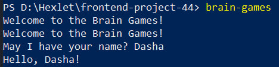
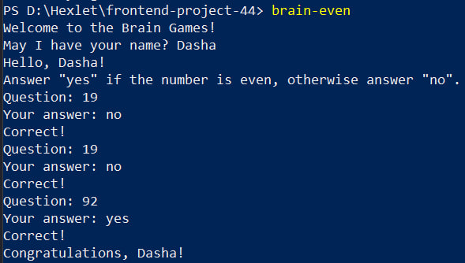
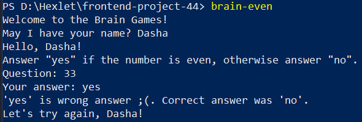
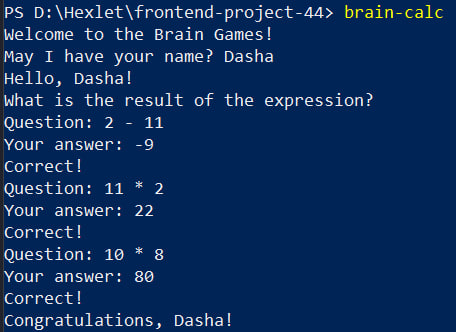
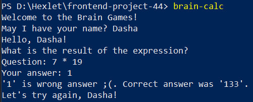
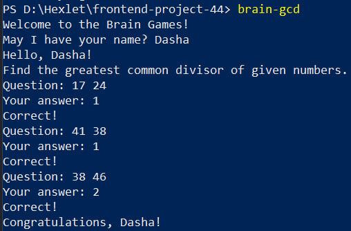
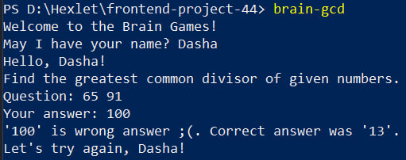
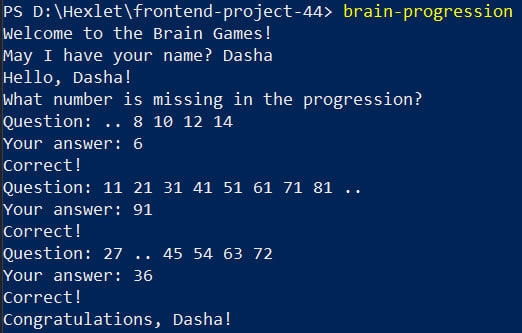
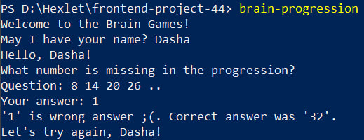
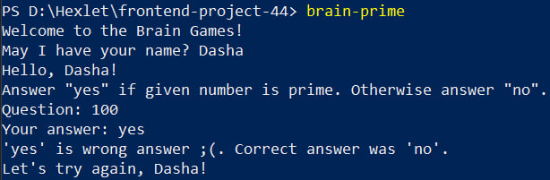

### Hexlet tests and linter status:

Описание проекта
Проект: Игры разума. Включает в себя 5 консольных игр (brain-games), написанных на Node.js
Минимальные требования
Для работы проекта необходимо:
- Node.js (версичя 16.х или выше)
- npm
-Git
Инструкции по установке и запуску
1.	Клонировать репозитория
git clone https://github.com/sodafianya/frontend-project-44.git 
cd frontend-project-44
2.	Установка зависимостей
npm install
3.	Установка проекта глобально
npm link
Запуск игр
Основные команды:
brain-games – Приветствие пользователя в игре, запрос его имени и приветствие его по имени;
brain-even – Игра: «Проверка на четность»;
brain-calc - Игра: «Калькулятор»;
brain-gcd - Игра: «НОД»;
brain-progression - Игра: «Арифметическая прогрессия»;
brain-prime - Игра: «Простое ли число?».
Дополнительные команды:
npm run lint - линтинг (проверка кода)
npm run lint:fix – автоматическое исправление ошибок

Демонстрация игрового процесса
brain-games
  
brain-even
 
   
brain-calc
 
   
brain-gcd
 
   
brain-progression
 
   
brain-prime
 
   